# Helm Chart 實現

## 清單

以下是題目要求的清單文件列表
- [x] Deployment.yaml
- [x] Service.yaml
- [x] Ingress.yaml
- [x] values.yaml 

因爲考慮到題目中提到要求 autoscaler，所以額外增加 hpa.yaml

- hpa.yaml

監控需要，驗証 CRD 是否真正的有效，額外增加，結果可以在後續的截圖中看到
- servicemonitor.yaml

另外增加了幾個文件，本來是打算做一下權限控製，但實際上這個業務不需要與 API Server 交互，所以在 values 中將 enabled 設置爲 false，不啟用這幾個文件了。
- role.yaml
- serviceaccount.yaml
- rolebinding.yaml

## Deployment

### Probes: 使用 /actuator/health 做 Probe 探測

我先説一下 probes，除了題目中要求的 liveness 和 readiness，我額外增加了 startupProbe

```YAML
probes:
  enabled: true
  startupProbe:
    httpGet:
      path: /actuator/health
      port: http
    periodSeconds: 5
    failureThreshold: 30
  liveness:
    path: /actuator/health
    port: http
    periodSeconds: 30
    timeoutSeconds: 3
    failureThreshold: 3
  readiness:
    path: /actuator/health
    port: http
    periodSeconds: 5
    timeoutSeconds: 3
```

因爲 Java 應用在啟動時可能需要較長時間來加載類和初始化資源，所以我增加了 `startupProbe`，它會在應用啟動時進行探測，確保應用已經準備好接受請求。

在`startupProbe`中，需要快一些，所以我設置了 `periodSeconds` 爲 5 秒，`failureThreshold` 爲 30，這樣可以在應用啟動時進行多次探測，確保應用已經準備好。

我看到題目中要求使用 `/hello` 路徑進行探測，但是這樣會有一個問題，`/hello` 是一個業務接口，而用業務接口來做探測可能會導緻一些問題，比如：
- 如果業務接口有變更，可能會導緻探測失敗。
- 如果業務接口有性能問題，可能會導緻探測超時。
- 如果業務接口有bug，可能會導緻探測失敗。
- 如果業務接口依賴其他服務，可能會導緻探測失敗。
- 最重要的一條：一個項目可能有非常多的業務接口，如果都用業務接口來做探測，可能會導緻探測的複雜度和維護成本非常高。

我看了下 `api.http` 文件，提供了一個 `/actuator/health` 路徑，這個路徑是一個健康檢查接口，從 pom 文件中可以看到，這個項目是一個 Spring Boot 項目，並且使用了 Spring Boot Actuator 模塊。


因此，我選擇使用 `/actuator/health` 路徑來做探測，這個路徑是 Spring Boot 提供的健康檢查接口，專門用於探測應用的健康狀態。

#### 解決業務接口 BLOCKED 問題
題目要求在 `/hello` 在 100 秒出現 BLOCKED 狀態時，通過 Probe 探針來重啟 Pod，並在重啟前將 jstack 輸出到日誌中，我現在替換了探測接口爲 `/actuator/health`，所以現在直接通過 Probe 實現不了。

#### 解決方案：繫統化、標準化 DevOps 流程
首先，我在這假設當前團隊使用的是 Prometheus + Grafana 進行監控和可視化。（如果不是，可以根據實際情況調整）

題目中提到 `/hello` 在 100 秒後會髮生 BLOCKED，這是一個線程指標，交給 prometheus 來採集，所有的業務接口隻要髮生異常，都可以通過監控來採集。這個項目是使用 Spring Boot 開髮的，有2個方案可供選擇
1. 使用 Spring Boot Actuator + Micrometer
2. 使用 Spring Boot Actuator + JSON Exporter

我推薦使用第一種方案，因爲它更符合雲原生的理唸，且更易於維護。但是我本地測試時使用了第二種方案，主要是因爲我在大陸，網絡極其受限，很多 image 沒辦法拉下來（通過代理能解決部分問題，但並不總是有效），沒有在本地集群安裝 Prometheus 和 Grafana，所以隻能使用 JSON Exporter 來模擬。

圖示：大多數情況如圖所示，每一步都可能遇到網絡不通...
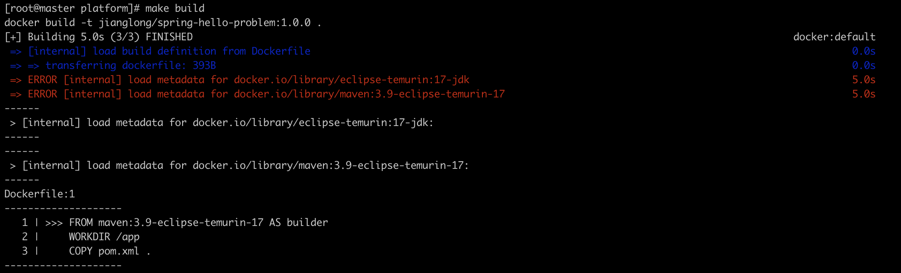

圖示：/actuator/metrics/jvm.threads.states?tag=state:blocked"輸出結果
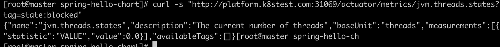

---- 分割一下 ----
後來網路暫時可用了，我把 Micrometer 的方案也測試了一下，結果如下：

圖示：/actuator/prometheus 輸出結果，已經拿到了 BLOCKED 指標


那目前開放了這些 endpoints：
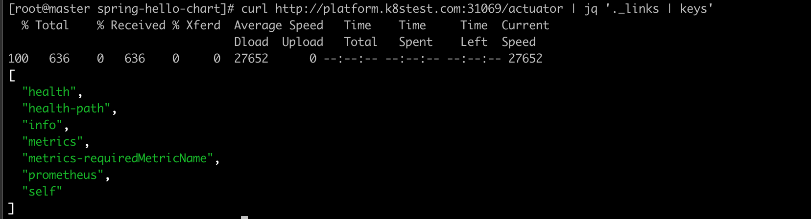

當髮生了 BLOCKED 將 jstack 輸出到本地磁盤 /var/log/java-dump/spring-hello-problem-spring-hello-chart-7fb586c85b-m5bmw-1754894403.log：
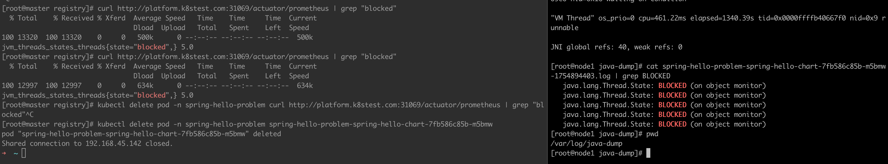

這是對應的配置，放在 values.yaml 中，通過 preStop 來實現，這裡爲了腳本更健壯，我不直接冩死 PID。

```YAML
lifecycle:
  preStop:
    enabled: true
    gracePeriodSeconds: 30
    script: |
      set -eu
      ts=$(date +%s)
      PID="$(jcmd -l | awk ''NR==1{print $1}'')" || exit 0
      mkdir -p /var/log/java-dump
      jstack -l "$PID" > /var/log/java-dump/$(hostname)-$ts.log 2>&1 || true
      sleep 5
```

我在現有的項目裡支持了多種採集方式，可以通過 values 來控製採集，方案一是通過 sidecar 容器來採集，相對來説不是那麼規範，也不那麼雲原生，會相對消耗更多的資源，但可以快速實現。方案二是通過 Micrometer 來採集，這個方案更符合雲原生的理唸，且更易於維護。

**另外還需要考慮的一個問題：** 在生産環境中，特別是很多服務都比較老了，存在技術債務，需要考慮改造的成本以及兼容性等等。這個題目是基於 Spring Boot 開髮的，使用 Micrometer 是比較合適的選擇，但如果是其他框架或語言，可能需要根據實際情況調整。

當採集到了數據後，可以通過 Prometheus 的 Alertmanager 來設置告警規則，當某個業務接口的 BLOCKED 狀態超過一定閾值時，觸髮告警，這裡往後的流程，就可以做很多事情了
比如：
- 通過 webhook 通過 GitOps 流程觸髮 Argo CD 自動化重啟 Pod
- 通過 webhook 調用自動化腳本，執行 jstack 命令並將輸出結果保存到日誌中
- 通過 webhook 調用自動化腳本，執行其他操作，比如髮送通知等

當然，直接使用 webhook 可以算是一種很好的方案，但更好的方案是可以考慮將後續環節平颱化，形成一個完整的自動化處理流程。因爲當故障髮生後，需要考慮以下問題：

1、如何快速定位故障？
2、如何快速恢複服務？
3、如何避免同類問題再次髮生？
4、能否自動化處理？
5、如何將處理過程標準化？
6、如何將處理過程可視化？
7、如何將處理過程記錄下來，便於後續分析？
8、如何將處理過程與團隊協作工具集成？
9、故障髮生後，這些數據怎麼留存並用於後續分析？
10、如何優化當前的監控能力？
...我大概列舉了10個問題，這些問題都是在故障髮生後需要考慮的。
最重要的一點，當未來有新的同事加入團隊，如何讓他們快速了解整個自動化處理流程？以最快的速度上手工作。

GitOps 解決了一部分 CD 問題，如果想要更好的解決方案，可以考慮將整個流程平颱化，形成一個完整的自動化處理流程。

#### 方案設計
Altermanager 推送的告警，接入到 SRE Agent 中，由這個智能體來接收告警，然後設計成一個平颱，接收到告警後，Agent拆解任務，然後調用 MCP 服務來完成所有的任務，最後將分析結論、處理方案、可視化數據圖表等 通過 websokcet 或者 SSE 推送到IM 或者前端平颱，如果有解決方案，並且是明確的指令，提問用戶是否需要 Agent 自動執行，並將其創建爲一個 job，可視化整個過程，這裡可以有多種方案，比如延用 GitOps 來觸髮 Argo CD，完成處理再進行數據採集和分析，得出結論後告知用戶。這樣將整個 Agent 融合進雲原生環境中，實現 AIOps。我讓 AI 幫忙畫了一個簡略的架構圖，把雲原生環境和 Agent 結合起來，形成一個完整的自動化處理流程：

圖示：AIOps Agent 架構圖


總結來説就是實現 監控 -> 告警 -> SRE Agent -> MCP 工具 -> 執行 -> 驗証 -> 優化 的閉環，這是我認爲可以平颱化的過程。在我看來，實際上平颱還需要包含很多子繫統，才能真正實現整個完整的SRE雲平颱，比如：
- 可觀測繫統：不直接使用 grafana，而是使用一個可觀測性平颱，提供更豐富的可視化和分析能力。
- 故障治愈繫統：這個是核心，提供故障自動化處理能力。與 Agent 的區別是，Agent 可用於處理一些未知且複雜的故障，而故障治愈繫統則是針對已知的、常見的故障進行自動化處理。這類已知問題，直接通過告警到治愈繫統，完成自動化的處理。
- 故障管理繫統：提供故障的全生命週期管理，包括故障的髮現、處理、驗証、分析和總結等。這些數據都非常有價值，這裡的故障數據指的不是監控告警，是更高層次的故障數據，比如業務異常、性能問題等。舉個例子，沒有被監控髮現的故障，記錄平颱後，需要深入分析，反向來優化整個監控的能力。
- 作業繫統：提供作業的全生命週期管理，包括作業的創建、執行、監控、分析和總結等。作業可以是自動化腳本、自動化測試、自動化部署等。有一些任務是一次性調度，比如臨時創建一個 pod 來完成特定任務後立刻銷毀，這時候作業繫統就派上大用場，不走 GitOps 流程。(我們在做模型訓練就是依賴該模式來實現)

#### 處理流程
那麼回到剛才的問題，`BLOCKED` 髮生後的處理流程：
1. 通過 Prometheus 採集 `/actuator/metrics/jvm.threads.states?tag=state:blocked` 的數據。
2. 通過 Alertmanager 設置告警規則，當 BLOCKED 狀態超過一定閾值時，觸髮告警。
3. 告警推送到 SRE Agent。
4. SRE Agent 拆解任務，調用 MCP 服務來完成所有的任務。
5. 執行 jstack 命令並將輸出結果保存到日誌中。
6. 將分析結論、處理方案、可視化數據圖表等通過 websocket 或者 SSE 推送到 IM 或者前端平颱。
7. 如果有明確的解決方案，提問用戶是否需要 Agent 自動執行，並將其創建爲一個 job。
8. 用戶同意，Agent 自動執行處理方案，提交 PR，自動走 GitOps 流程。
9. 可視化整個過程，完成處理再進行數據採集和分析，得出結論後告知用戶。
10. 數據留存並用於後續分析，優化監控能力。

### Resources 配置
 
```
resources:
  requests:
    cpu: "100m"
    memory: "128Mi"
  limits:
    cpu: "100m"
    memory: "128Mi"
```

對於這個配置，我直接調整成了 requests = limits，因爲這樣能避免資源競爭，這樣做的話優先級最高。再者就是這個項目是一個新的項目，我也不知道業務情況如何，所以先給了一個比較小的值（這裡我假設了業務量不大），增加了 HPA 來保証應用的可伸縮性，避免突髮流量導緻資源不足。

在生産環境則不同，比較好的方式是通過 Prometheus 查看該服務過去 30 天 CPU 使用率分佈，確認 100m 是否覆蓋 P99 峰值。另外就是如果髮現週期性突破限製，需判斷是 業務增長（需 HPA） 還是 代碼低效（如循環冗餘計算）。 不得不説，很多項目中，代碼低效才是元兇...

### 權限最小化

額外加了兩個配置，讓 Pod 不會掛載 token，因爲這個場景下不需要訪問 Kubernetes API Server，顯示的把權限最小化。

```YAML
automountServiceAccountToken: {{ default false .Values.pod.automountServiceAccountToken }}
serviceAccountName: {{ include "spring-hello-chart.serviceAccountName" . }}
```

在生産環境需要在 Deployment 中加上這幾個配置，來保証權限最小化，但是因爲加上後 preStop 就沒法轉儲日誌到當前 node 的磁盤上，想要訪問則需要額外配置該目錄的所有權歸啟動用戶所有，所以這次測試中暫時不加限製。

```YAML
securityContext:
  runAsNonRoot: true
  runAsUser: userID
  readOnlyRootFilesystem: true
  capabilities:
    drop:
      - "ALL"
```

### 日誌轉儲

現在jstack轉儲是用本地捲掛載，雲原生需要使用stdout的方式收集，統一上報到日誌平颱，這樣可以更好地進行日誌分析和處理。

```YAML
          lifecycle:
            preStop:
              exec:
                command:
                  - /bin/sh
                  - -c
                  - |
          {{- (.Values.lifecycle.preStop.script | default "") | nindent 26 }}
          {{- end }}
          {{- if .Values.env }}
          env:
          {{- range $k, $v := .Values.env }}
            - name: {{ $k }}
              value: {{ $v | quote }}
          {{- end }}
          {{- end }}

          volumeMounts:
            - name: java-dump-volume
              mountPath: /var/log/java-dump

      volumes:
        - name: java-dump-volume
          hostPath:
            path: /var/log/java-dump
            type: DirectoryOrCreate
        {{- if .Values.jmxExporter.enabled }}        
        - name: jmx-config-volume
          configMap:
            name: {{ include "spring-hello-chart.fullname" . }}-jmx-config
        {{- end }}
```

## HPA

```YAML
autoscaling:
  enabled: true
  minReplicas: 3
  maxReplicas: 10
  targetCPUUtilizationPercentage: 80
  targetMemoryUtilizationPercentage: 70
```

一般來説，一個服務的特性決定了 HPA 配置，也就是需要考慮這個問題：這個應用的流量模式是怎樣的？QPS 、cpu utilization、memory utilization 是平滑變化，還是有明顯的尖峰和低谷？這些指標是需要真實的環境才能得到，需要真正的在生成環境跑跑，就知道策略如何調整了。對於一個新的服務來説，最開始直接使用默認策略也沒什麼問題。

但實際上傳統的 HPA 策略有一些缺點，比如：

- 隻能基於 CPU 和內存進行擴縮容，無法基於業務指標
- 擴縮容的粒度較大，可能導緻資源浪費或不足
- 無法基於多指標進行擴縮容

那麼可以考慮使用 KEDA（Kubernetes Event-driven Autoscaling）來解決這些問題。KEDA 是一個開源項目，可以基於多種事件源（如消息隊列、數據庫等）進行自動擴縮容。

但是 KEDA 還是有一個問題解決不了，也就是滯後性，這是傳統的 HPA 所無法避免的。一旦流量激增，需要一定的時間來檢測到這個變化，然後再進行擴容，這個過程可能會導緻服務不可用。

另一個方案是可以考慮使用 AI 來解決這個問題。AI 可以通過分析曆史數據和實時數據，預測未來的流量變化，從而提前進行擴縮容。這樣可以大幅降低滯後性，提高服務的可用性。 
但是 AI 在 Kubernetes 自動伸縮（Autoscaling）領域的應用，目前正處於探索和早期落地的階段，也同樣存在問題，比如數據的準確性、模型的複雜性等。如果預測不準確，可能會導緻資源的浪費或不足。但我依舊認爲，這是一個值得期待和探索的方向。

## Service

```YAML
service:
  type: ClusterIP
  port: 8080
  targetPort: http

  metrics:
    enabled: true
    ports:
      - name: jmx-metrics
        port: 5556
        targetPort: 5556
```

因爲配置了 Ingress，所以 Service 的類型使用了 ClusterIP，這樣可以通過 Ingress 來訪問服務。端口配置爲 8080，targetPort 爲 http，這樣可以確保服務能夠正常訪問。額外配置了 JMX Metrics 的端口 5556，這樣可以通過 JMX Exporter 來採集應用的指標數據。

## Ingress

```YAML
ingress:
  enabled: true
  className: "nginx"
  annotations:
    nginx.ingress.kubernetes.io/rewrite-target: /
    nginx.ingress.kubernetes.io/proxy-read-timeout: "5"
  hosts:
    - host: "platform.k8stest.com"
      paths:
        - path: /
          pathType: Prefix
```

### Nginx Ingress Controller
Ingress 的配置使用了 Nginx Ingress Controller，配置了重冩規則和代理讀取超時時間。主機名爲 `platform.k8stest.com`，路徑爲 `/`，這樣可以通過域名訪問服務。
我説一下爲什麼使用 Nginx Ingress Controller，因爲它是 Kubernetes 中最常用的 Ingress Controller，功能強大且易於配置。它支持多種負載均衡算法、SSL/TLS 終端、重冩規則等功能，非常適合用於生産環境。

圖示：訪問`http://platform.k8stest.com:31069/actuator/health`
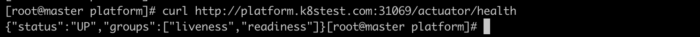

### 用戶體驗問題
另外需要考慮的一個問題，業務接口出現死鎖，用戶可能等待很久都沒有響應，那麼在 Ingress 上配置一個超時時間是非常有必要的。這裡我設置了 `nginx.ingress.kubernetes.io/proxy-read-timeout: "5"`，表示如果請求在 5 秒內沒有響應，就會返回 504 Gateway Timeout 錯誤。特別是電商類應用，接口響應時間過長，用戶體驗會非常差，所以設置一個合理的超時時間是非常重要的。

其實這裡也要分很多種情況來配置超時，比如：

- 查詢類，用戶在打開頁麵檢索商品，對於直接麵向用戶的核心API，理想的響應時間應控製在 500ms 以內，力爭達到 200ms，極限不應超過 2-3秒
- 操作類，比如用戶下單（雙十一活動等），這涉及到數據庫操作，用戶在下單時，理想的響應時間應控製在 1 秒以內，極限不應超過 5 秒
- 外部依賴類，這些是屬於保証事務的完整性，超時可以延長一些沒問題

我在這裡假定這是一個操作類接口，所以設置了 5 秒的超時時間。實際上，超時時間的設置需要根據業務場景和用戶體驗來綜合考慮。
另外就是剛才提到的外部依賴類，需要在 service mesh 中配置超時時間，確保在調用外部服務時能夠及時返回錯誤，而不是一直等待。 

我們可以把超時的指標採集納入到監控繫統中，及時髮現和處理超時問題。但如果某個接口或服務經常超時，我認爲如何解決超時問題才是至關重要的，需要考慮多個方麵：

- 代碼問題：是否存在性能瓶頸，是否有優化空間？
- 架構問題：是否存在單點故障，是否有冗餘設計？
- 資源問題：是否存在資源不足，是否有擴容空間？
- 網絡問題：是否存在網絡延遲，是否有優化空間？
- 依賴問題：是否存在外部依賴，是否有可靠性保障？

根據我的個人經驗，遇到最多的往往是代碼問題 or 下遊服務不可用導緻的超時，比如依賴 redis 服務，可能會因爲網絡延遲、連接池耗儘等原因導緻超時。這就需要我們在代碼層麵進行優化，比如使用異步調用、Pipeline 批處理等等。這裡隻是舉個例子。

## 監控採集情況

因爲我是本地cluster，先開啟端口轉髮：

```
kubectl -n monitoring port-forward svc/kube-prometheus-stack-prometheus 19090:9090 >/dev/null 2>&1 &
```

項目的/metrics和/actuator/prometheus接口都可以正常訪問

```
curl -s ''http://127.0.0.1:19090/api/v1/targets?state=active'' | jq ''.data.activeTargets[] | select(.labels.namespace=="spring-hello-problem") | {job:.labels.job, instance:.labels.instance, metrics_path:.discoveredLabels.__metrics_path__, health:.health, lastError:.lastError}''
```


BLOCKED 指標採集情況

```
curl -G ''http://127.0.0.1:19090/api/v1/query'' --data-urlencode ''query=sum by (pod) (jvm_threads_states_threads{namespace="spring-hello-problem",state="blocked"})'' | jq
```


GC 指標採集情況（這裡隻看一個 GC Pause 的指標）

```
curl -G ''http://127.0.0.1:19090/api/v1/query'' --data-urlencode ''query=sum by (pod) (rate(jvm_gc_pause_seconds_sum{namespace="spring-hello-problem"}[5m]))'' | jq
```


## Review

這是題目清單的要求：


- Helm templating: DONE
- Probes & resource limits: DONE
- Pre-restart diagnostics: DONE
- JVM observability: DONE

每一項都總結一下：

- Helm templating: DONE

項目中包含了題目要求的所有 yaml，以及將動態變化的配置參數放在了 `values.yaml` 文件中，使用 Helm 模闆引擎來渲染配置文件。包含了基本的 yaml 和額外引入的 yaml（比如 hpa.yaml）

這是 values.yaml 中要求存在的參數：


目前都已覆蓋：

- [x] image.repository
- [x] image.tag
- [x] resources
- [x] ingress.enabled
- [x] service.type
- [x] probes.enabled
- [x] jvmExporter.enabled
- [x] jvmExporter.crdInstall

- Probes & resource limits: DONE

這裡使用了 `/actuator/health` 作爲探針接口，配置了 liveness、readiness 和 startup probes。資源限製設置爲 CPU 100m，內存 128Mi 的請求，CPU 100m，內存 128Mi 的限製。

- Pre-restart diagnostics: DONE

`BLOCKED` 後的操作，不直接使用 preStop 來實現，因爲這屬於業務監控指標，使用 Prometheus + Grafana 來監控 BLOCKED 狀態，並通過 Alertmanager 推送告警到 SRE Agent，完成自動化處理。或者短期方案是 Webhook + Scripts 來實現。另外建議通過 STDOUT 的方式來收集日誌，統一上報到日誌平颱，這樣符合雲原生的理唸。

- JVM observability: DONE

項目中提供了兩種方式來採集 JVM 指標數據（包括 GC / Thread 等）：
1. 使用 Micrometer + Prometheus，直接通過 `/actuator/prometheus` 接口
2. 使用 JSON Exporter，這裡我實際上還差一步，我隻做到通過 `/actuator/metrics` 接口採集數據，我沒有將 `/actuator/metrics` 接口的 JSON 輸出轉成 Prometheus 格式，但可以通過 JSON Exporter 來實現。

## 總結

這次測試絶大部分時間都是花在處理網絡環境上，基本上走一步卡一步（欲哭無淚，Docker Hub 貌似是把大陸 IP 列入黑名單了），所以我是通過一些特殊的方式來解決鏡像問題。

在生産環境下，安全性、穩定性和可維護性是非常重要的。如果在生産環境，需要把權限再收斂一些，比如增加 NetworkPolicy 來限製 Pod 的網絡訪問，確保 Pod 隻能訪問必要的服務和資源。這一塊題目未要求，由於時間關繫我就沒有做，但生産環境的話，需要考慮進去。

# CI

這部分是最後一個環節，我覺得也非常重要，CI的高質量是保証整個項目順利進行的關鍵，相當於是第一道堅固的防線。

我日常開髮的流程遵循的是 gitflow 標準流程，比較習慣使用這樣的分支:

- 主分支：master
- 開髮分支：feature/*
- 修複分支：bugfix/*
- 預髮佈分支：release/*

所以我後續的操作都是以上麵的規範來做演示，並且每個分支都有對應的 CI 配置文件，因爲每個分支在 CI/CD 流程中都扮演着不同的角色。這裡我主要關注的是主分支和開髮分支的 CI 配置。

- master：包括了生産所需要的準備，比如鏡像構建、驗証 helm 有效性等等
- feature/*：包括了開髮所需要的準備，比如代碼掃描等等

圖示：這是 master 分支的 CI 流水線觸髮情況，包含了題目要求的 image push 到 dockerhub，並進行 helm 驗証等。


本地在測試的過程中，使用 yamllint 工具檢測 yaml 格式是否正確：

```
yamllint .github/workflows/dev-pipeline.yml
yamllint .github/workflows/pipeline.yml
```

圖示：yamllint結果


我在 CI 文件中配置了分支限製，因爲需要確保每個分支都隻執行對應的 pipeline。

```
name: Dev CI Pipeline

"on":
  pull_request:
  push:
    branches:
      - ''feature/**''
    paths-ignore:
      - "**/*.md"
```

```
name: Master CI Pipeline

"on":
  pull_request:
  push:
    branches:
      - ''master''
    paths-ignore:
      - "**/*.md"
```

實際上想要保持版本統一，最好的做法是通過打 tag 來觸髮 CI 流程，這樣可以把 tag 當做事實來源，並使得 image 版本和 git 版本保持一緻。我這裡沒有進行相關的配置演示了。

## 驗証非 gitflow 相關分支的 CI 流程

**驗証通過，在 main 分支推送代碼後，不觸髮任何的 CI**

圖示：通過 main 分支 push，對應的 commit 爲 9e2a48


圖示：沒有對應的 commit 觸髮 CI
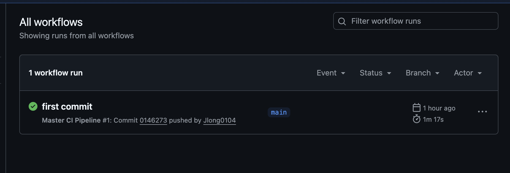

## 驗証 feature 分支的 CI 流程

圖示：通過 feature/ci-test 分支 push，對應的 commit 爲 4eb7e05
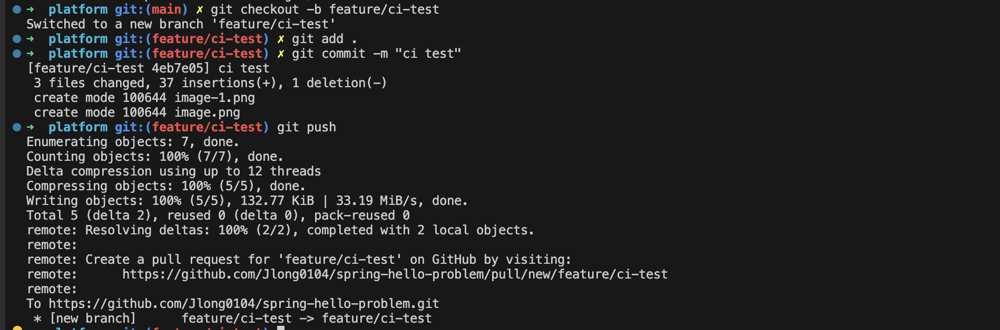

圖示：feature/ci-test 分支觸髮了 CI
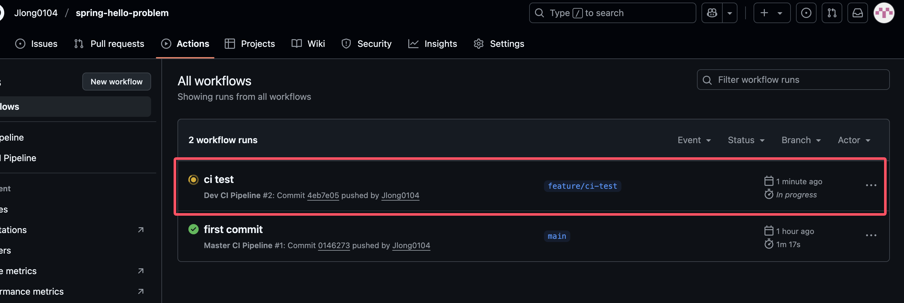

由於 feature 分支的 CI 流程中包含了代碼掃描、單元測試、鏡像掃描、安全掃描等，所以實際上目前的項目掃描出來基本上都是失敗，由於時間關繫，我沒有去做修正（包括 Pod 的安全級別配置等等）。我隻嚐試昇級 Spring Boot 的版本，結果是可以通過的。 

圖示：安全掃描報出漏洞，不通過
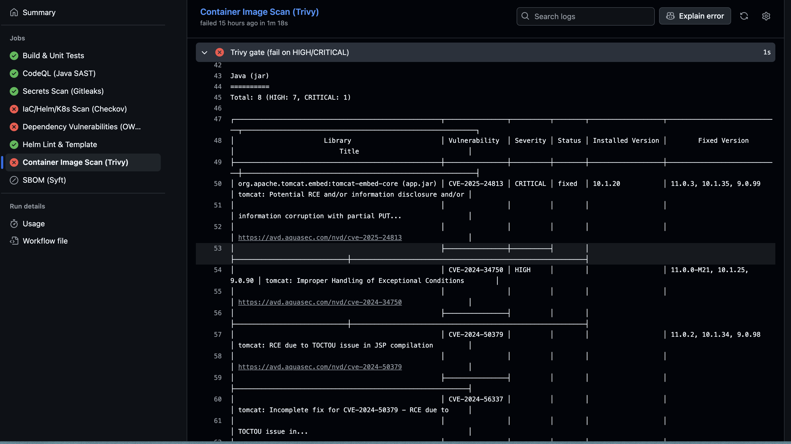

圖示：昇級 Spring Boot 版本後，掃描通過
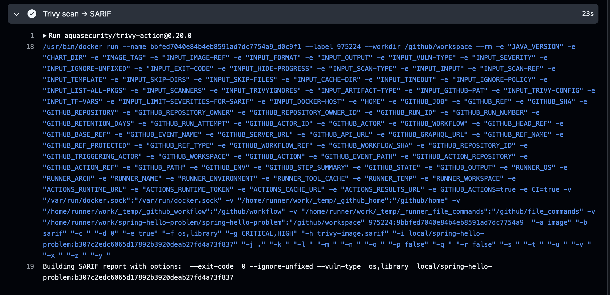

## 不同語言之前的 CI 差異

我日常最多的場景是對 Go 項目的 CI/CD，往往包括這些環節：代碼檢查、單元測試、構建鏡像、安全掃描、性能測試。實際上這些環節都適用於所有的語言項目中。上生産前我一般都會強製做集成測試，因爲很多功能點相對比較複雜，涉及並髮驗証，沒辦法用簡單的單元測試覆蓋，所以需要在上生産前，強製集成測試，能兜住至少 90% 的真實場景。

我覺得不管有多少項目和技術棧，可以按照三步來實現更好的 CI：
1、先製定 CI 規範，並將其模闆化
2、將模闆應用到各個項目中
3、持續優化 CI 流程

這樣隻需要修改模闆，比如未來接入 AI 等新技術時，可以快速適配。

## 將 CI 模闆化並測試

題目中要求的是把 CI 文件命名爲 `pipeline.yml`，那這個流程的測試已經通過了，包括helm驗証等。我將其抽象成模闆 `standard-master-ci.yml`，並在`master-ci.yml`中引用。

這是測試結果，兩者的行爲一緻

圖示：`pipeline.yml` 和 `master-ci.yml` 同時觸髮並通過
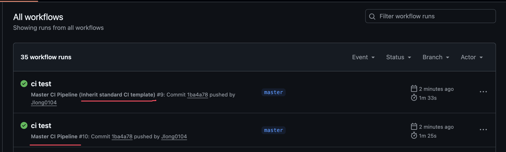

圖示：`pipeline.yml`的 helm dry-run結果
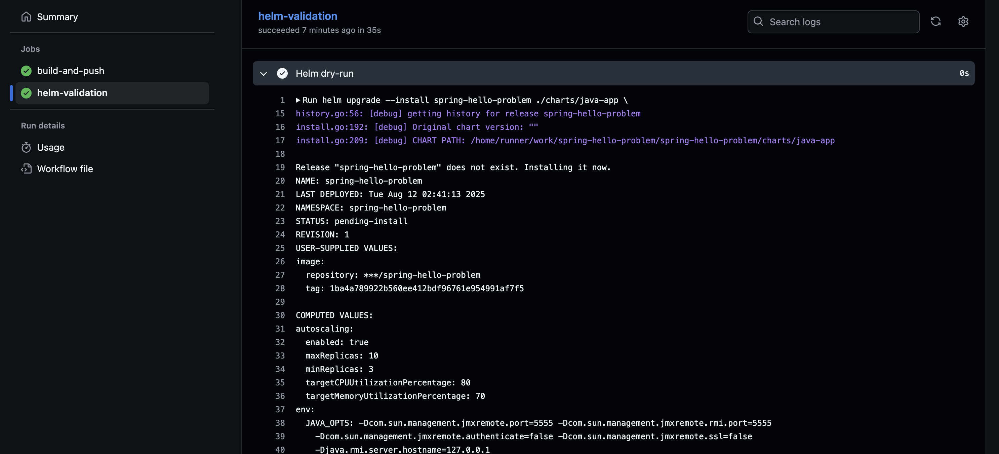

圖示：`master-ci.yml`的 helm dry-run結果


# 總結與思考

生産環境的 CI/CD 實際上比這要複雜得多很多，包括跨平颱，需要麵對不同的操作繫統，需要麵對不同的技術棧等等。題目目前隻要求做到 CI 環節就結束了，在我看來，更複雜以及更有挑戰性的，是在 CD 環節，因爲一旦髮佈，那就是開始了真正的考驗。因爲 CI 失敗了無傷大雅，可以多次調試，並且流程相對固定。CI 的難點更多的在於 效率、成本 這兩者，因爲 github 的 CI 是付費的，所以從公司的成本考慮如何保証 CI 質量的同時，最大程度降低成本。效率則是要求 CI 要快，越快越好，那麼就可以從緩存、私有化等方向去嚐試。

CD 需要考慮的因素有很多，比如髮佈策略、回滾機製、環境一緻性等。髮佈策略可以選擇金絲雀髮佈、藍綠髮佈、滾動更新等方式。當然在雲原生的生態中，這些已經得到了很好的解決，而我更多是在應對物理環境的變更髮佈，解決方案上肯定會有很大差異，但整體都是圍繞這四個點來做：穩定性、效率、成本、安全。對於 CD 最基本的能力包括 流程編排、髮佈策略、並髮控製、回滾策略等。

GitOps 實際上也能朝着 AIOps 髮展，通過自動化和智能化的方式來提昇運維效率和繫統穩定性，但在整個繫統中仍然依賴 GitOps，這是雲原生環境的的 CD 最好的底座之一，能夠爲 AIOps 提供強有力的支撐。