# Helm Chart 实现

## 清单

以下是题目要求的清单文件列表
- [x] Deployment.yaml
- [x] Service.yaml
- [x] Ingress.yaml
- [x] values.yaml 

因为考虑到题目中提到要求 autoscaler，所以额外增加 hpa.yaml

- hpa.yaml

监控需要，验证 CRD 是否真正的有效，额外增加，结果可以在后续的截图中看到
- servicemonitor.yaml

另外增加了几个文件，本来是打算做一下权限控制，但实际上这个业务不需要与 API Server 交互，所以在 values 中将 enabled 设置为 false，不启用这几个文件了。
- role.yaml
- serviceaccount.yaml
- rolebinding.yaml

## Deployment

### Probes: 使用 /actuator/health 做 Probe 探测

我先说一下 probes，除了题目中要求的 liveness 和 readiness，我额外增加了 startupProbe

```YAML
probes:
  enabled: true
  startupProbe:
    httpGet:
      path: /actuator/health
      port: http
    periodSeconds: 5
    failureThreshold: 30
  liveness:
    path: /actuator/health
    port: http
    periodSeconds: 30
    timeoutSeconds: 3
    failureThreshold: 3
  readiness:
    path: /actuator/health
    port: http
    periodSeconds: 5
    timeoutSeconds: 3
```

因为 Java 应用在启动时可能需要较长时间来加载类和初始化资源，所以我增加了 `startupProbe`，它会在应用启动时进行探测，确保应用已经准备好接受请求。

在`startupProbe`中，需要快一些，所以我设置了 `periodSeconds` 为 5 秒，`failureThreshold` 为 30，这样可以在应用启动时进行多次探测，确保应用已经准备好。

我看到题目中要求使用 `/hello` 路径进行探测，但是这样会有一个问题，`/hello` 是一个业务接口，而用业务接口来做探测可能会导致一些问题，比如：
- 如果业务接口有变更，可能会导致探测失败。
- 如果业务接口有性能问题，可能会导致探测超时。
- 如果业务接口有bug，可能会导致探测失败。
- 如果业务接口依赖其他服务，可能会导致探测失败。
- 最重要的一条：一个项目可能有非常多的业务接口，如果都用业务接口来做探测，可能会导致探测的复杂度和维护成本非常高。

我看了下 `api.http` 文件，提供了一个 `/actuator/health` 路径，这个路径是一个健康检查接口，从 pom 文件中可以看到，这个项目是一个 Spring Boot 项目，并且使用了 Spring Boot Actuator 模块。


因此，我选择使用 `/actuator/health` 路径来做探测，这个路径是 Spring Boot 提供的健康检查接口，专门用于探测应用的健康状态。

#### 解决业务接口 BLOCKED 问题
题目要求在 `/hello` 在 100 秒出现 BLOCKED 状态时，通过 Probe 探针来重启 Pod，并在重启前将 jstack 输出到日志中，我现在替换了探测接口为 `/actuator/health`，所以现在直接通过 Probe 实现不了。

#### 解决方案：系统化、标准化 DevOps 流程
首先，我在这假设当前团队使用的是 Prometheus + Grafana 进行监控和可视化。（如果不是，可以根据实际情况调整）

题目中提到 `/hello` 在 100 秒后会发生 BLOCKED，这是一个线程指标，交给 prometheus 来采集，所有的业务接口只要发生异常，都可以通过监控来采集。这个项目是使用 Spring Boot 开发的，有2个方案可供选择
1. 使用 Spring Boot Actuator + Micrometer
2. 使用 Spring Boot Actuator + JSON Exporter

我推荐使用第一种方案，因为它更符合云原生的理念，且更易于维护。但是我本地测试时使用了第二种方案，主要是因为我在大陆，网络极其受限，很多 image 没办法拉下来（通过代理能解决部分问题，但并不总是有效），没有在本地集群安装 Prometheus 和 Grafana，所以只能使用 JSON Exporter 来模拟。

图示：大多数情况如图所示，每一步都可能遇到网络不通...
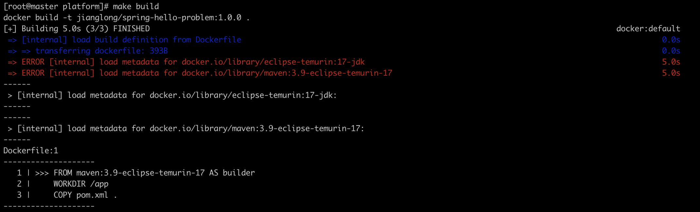

图示：/actuator/metrics/jvm.threads.states?tag=state:blocked"输出结果
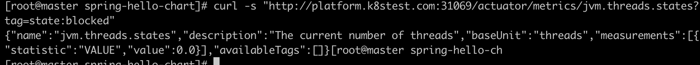

---- 分割一下 ----
后来网路暂时可用了，我把 Micrometer 的方案也测试了一下，结果如下：

图示：/actuator/prometheus 输出结果，已经拿到了 BLOCKED 指标
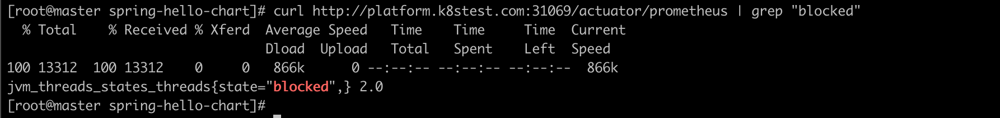

那目前开放了这些 endpoints：
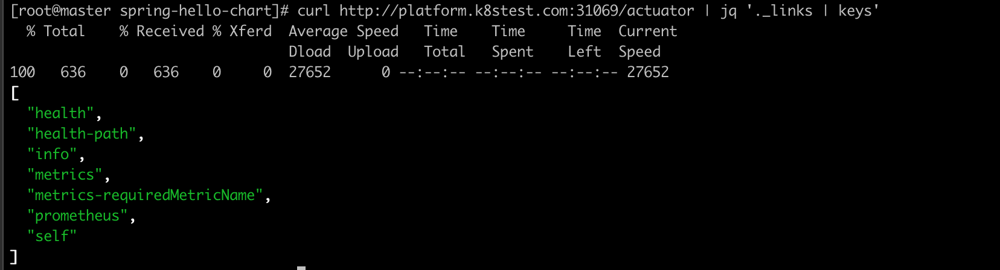

当发生了 BLOCKED 将 jstack 输出到本地磁盘 /var/log/java-dump/spring-hello-problem-spring-hello-chart-7fb586c85b-m5bmw-1754894403.log：
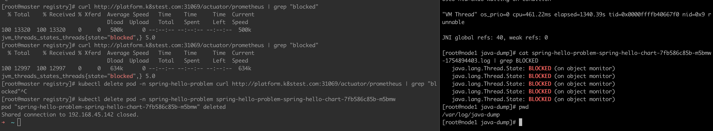

这是对应的配置，放在 values.yaml 中，通过 preStop 来实现，这里为了脚本更健壮，我不直接写死 PID。

```YAML
lifecycle:
  preStop:
    enabled: true
    gracePeriodSeconds: 30
    script: |
      set -eu
      ts=$(date +%s)
      PID="$(jcmd -l | awk 'NR==1{print $1}')" || exit 0
      mkdir -p /var/log/java-dump
      jstack -l "$PID" > /var/log/java-dump/$(hostname)-$ts.log 2>&1 || true
      sleep 5
```

我在现有的项目里支持了多种采集方式，可以通过 values 来控制采集，方案一是通过 sidecar 容器来采集，相对来说不是那么规范，也不那么云原生，会相对消耗更多的资源，但可以快速实现。方案二是通过 Micrometer 来采集，这个方案更符合云原生的理念，且更易于维护。

**另外还需要考虑的一个问题：** 在生产环境中，特别是很多服务都比较老了，存在技术债务，需要考虑改造的成本以及兼容性等等。这个题目是基于 Spring Boot 开发的，使用 Micrometer 是比较合适的选择，但如果是其他框架或语言，可能需要根据实际情况调整。

当采集到了数据后，可以通过 Prometheus 的 Alertmanager 来设置告警规则，当某个业务接口的 BLOCKED 状态超过一定阈值时，触发告警，这里往后的流程，就可以做很多事情了
比如：
- 通过 webhook 通过 GitOps 流程触发 Argo CD 自动化重启 Pod
- 通过 webhook 调用自动化脚本，执行 jstack 命令并将输出结果保存到日志中
- 通过 webhook 调用自动化脚本，执行其他操作，比如发送通知等

当然，直接使用 webhook 可以算是一种很好的方案，但更好的方案是可以考虑将后续环节平台化，形成一个完整的自动化处理流程。因为当故障发生后，需要考虑以下问题：

1、如何快速定位故障？
2、如何快速恢复服务？
3、如何避免同类问题再次发生？
4、能否自动化处理？
5、如何将处理过程标准化？
6、如何将处理过程可视化？
7、如何将处理过程记录下来，便于后续分析？
8、如何将处理过程与团队协作工具集成？
9、故障发生后，这些数据怎么留存并用于后续分析？
10、如何优化当前的监控能力？
...我大概列举了10个问题，这些问题都是在故障发生后需要考虑的。
最重要的一点，当未来有新的同事加入团队，如何让他们快速了解整个自动化处理流程？以最快的速度上手工作。

GitOps 解决了一部分 CD 问题，如果想要更好的解决方案，可以考虑将整个流程平台化，形成一个完整的自动化处理流程。

#### 方案设计
Altermanager 推送的告警，接入到 SRE Agent 中，由这个智能体来接收告警，然后设计成一个平台，接收到告警后，Agent拆解任务，然后调用 MCP 服务来完成所有的任务，最后将分析结论、处理方案、可视化数据图表等 通过 websokcet 或者 SSE 推送到IM 或者前端平台，如果有解决方案，并且是明确的指令，提问用户是否需要 Agent 自动执行，并将其创建为一个 job，可视化整个过程，这里可以有多种方案，比如延用 GitOps 来触发 Argo CD，完成处理再进行数据采集和分析，得出结论后告知用户。这样将整个 Agent 融合进云原生环境中，实现 AIOps。我让 AI 帮忙画了一个简略的架构图，把云原生环境和 Agent 结合起来，形成一个完整的自动化处理流程：

图示：AIOps Agent 架构图
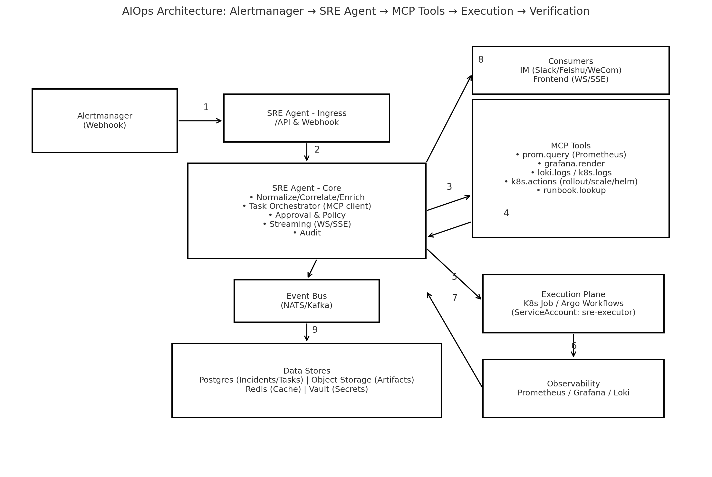

总结来说就是实现 监控 -> 告警 -> SRE Agent -> MCP 工具 -> 执行 -> 验证 -> 优化 的闭环，这是我认为可以平台化的过程。在我看来，实际上平台还需要包含很多子系统，才能真正实现整个完整的SRE云平台，比如：
- 可观测系统：不直接使用 grafana，而是使用一个可观测性平台，提供更丰富的可视化和分析能力。
- 故障治愈系统：这个是核心，提供故障自动化处理能力。与 Agent 的区别是，Agent 可用于处理一些未知且复杂的故障，而故障治愈系统则是针对已知的、常见的故障进行自动化处理。这类已知问题，直接通过告警到治愈系统，完成自动化的处理。
- 故障管理系统：提供故障的全生命周期管理，包括故障的发现、处理、验证、分析和总结等。这些数据都非常有价值，这里的故障数据指的不是监控告警，是更高层次的故障数据，比如业务异常、性能问题等。举个例子，没有被监控发现的故障，记录平台后，需要深入分析，反向来优化整个监控的能力。
- 作业系统：提供作业的全生命周期管理，包括作业的创建、执行、监控、分析和总结等。作业可以是自动化脚本、自动化测试、自动化部署等。有一些任务是一次性调度，比如临时创建一个 pod 来完成特定任务后立刻销毁，这时候作业系统就派上大用场，不走 GitOps 流程。(我们在做模型训练就是依赖该模式来实现)

#### 处理流程
那么回到刚才的问题，`BLOCKED` 发生后的处理流程：
1. 通过 Prometheus 采集 `/actuator/metrics/jvm.threads.states?tag=state:blocked` 的数据。
2. 通过 Alertmanager 设置告警规则，当 BLOCKED 状态超过一定阈值时，触发告警。
3. 告警推送到 SRE Agent。
4. SRE Agent 拆解任务，调用 MCP 服务来完成所有的任务。
5. 执行 jstack 命令并将输出结果保存到日志中。
6. 将分析结论、处理方案、可视化数据图表等通过 websocket 或者 SSE 推送到 IM 或者前端平台。
7. 如果有明确的解决方案，提问用户是否需要 Agent 自动执行，并将其创建为一个 job。
8. 用户同意，Agent 自动执行处理方案，提交 PR，自动走 GitOps 流程。
9. 可视化整个过程，完成处理再进行数据采集和分析，得出结论后告知用户。
10. 数据留存并用于后续分析，优化监控能力。

### Resources 配置
 
```
resources:
  requests:
    cpu: "100m"
    memory: "128Mi"
  limits:
    cpu: "100m"
    memory: "128Mi"
```

对于这个配置，我直接调整成了 requests = limits，因为这样能避免资源竞争，这样做的话优先级最高。再者就是这个项目是一个新的项目，我也不知道业务情况如何，所以先给了一个比较小的值（这里我假设了业务量不大），增加了 HPA 来保证应用的可伸缩性，避免突发流量导致资源不足。

在生产环境则不同，比较好的方式是通过 Prometheus 查看该服务过去 30 天 CPU 使用率分布，确认 100m 是否覆盖 P99 峰值。另外就是如果发现周期性突破限制，需判断是 业务增长（需 HPA） 还是 代码低效（如循环冗余计算）。 不得不说，很多项目中，代码低效才是元凶...

### 权限最小化

额外加了两个配置，让 Pod 不会挂载 token，因为这个场景下不需要访问 Kubernetes API Server，显示的把权限最小化。

```YAML
automountServiceAccountToken: {{ default false .Values.pod.automountServiceAccountToken }}
serviceAccountName: {{ include "spring-hello-chart.serviceAccountName" . }}
```

在生产环境需要在 Deployment 中加上这几个配置，来保证权限最小化，但是因为加上后 preStop 就没法转储日志到当前 node 的磁盘上，想要访问则需要额外配置该目录的所有权归启动用户所有，所以这次测试中暂时不加限制。

```YAML
securityContext:
  runAsNonRoot: true
  runAsUser: userID
  readOnlyRootFilesystem: true
  capabilities:
    drop:
      - "ALL"
```

### 日志转储

现在jstack转储是用本地卷挂载，云原生需要使用stdout的方式收集，统一上报到日志平台，这样可以更好地进行日志分析和处理。

```YAML
          lifecycle:
            preStop:
              exec:
                command:
                  - /bin/sh
                  - -c
                  - |
          {{- (.Values.lifecycle.preStop.script | default "") | nindent 26 }}
          {{- end }}
          {{- if .Values.env }}
          env:
          {{- range $k, $v := .Values.env }}
            - name: {{ $k }}
              value: {{ $v | quote }}
          {{- end }}
          {{- end }}

          volumeMounts:
            - name: java-dump-volume
              mountPath: /var/log/java-dump

      volumes:
        - name: java-dump-volume
          hostPath:
            path: /var/log/java-dump
            type: DirectoryOrCreate
        {{- if .Values.jmxExporter.enabled }}        
        - name: jmx-config-volume
          configMap:
            name: {{ include "spring-hello-chart.fullname" . }}-jmx-config
        {{- end }}
```

## HPA

```YAML
autoscaling:
  enabled: true
  minReplicas: 3
  maxReplicas: 10
  targetCPUUtilizationPercentage: 80
  targetMemoryUtilizationPercentage: 70
```

一般来说，一个服务的特性决定了 HPA 配置，也就是需要考虑这个问题：这个应用的流量模式是怎样的？QPS 、cpu utilization、memory utilization 是平滑变化，还是有明显的尖峰和低谷？这些指标是需要真实的环境才能得到，需要真正的在生成环境跑跑，就知道策略如何调整了。对于一个新的服务来说，最开始直接使用默认策略也没什么问题。

但实际上传统的 HPA 策略有一些缺点，比如：

- 只能基于 CPU 和内存进行扩缩容，无法基于业务指标
- 扩缩容的粒度较大，可能导致资源浪费或不足
- 无法基于多指标进行扩缩容

那么可以考虑使用 KEDA（Kubernetes Event-driven Autoscaling）来解决这些问题。KEDA 是一个开源项目，可以基于多种事件源（如消息队列、数据库等）进行自动扩缩容。

但是 KEDA 还是有一个问题解决不了，也就是滞后性，这是传统的 HPA 所无法避免的。一旦流量激增，需要一定的时间来检测到这个变化，然后再进行扩容，这个过程可能会导致服务不可用。

另一个方案是可以考虑使用 AI 来解决这个问题。AI 可以通过分析历史数据和实时数据，预测未来的流量变化，从而提前进行扩缩容。这样可以大幅降低滞后性，提高服务的可用性。 
但是 AI 在 Kubernetes 自动伸缩（Autoscaling）领域的应用，目前正处于探索和早期落地的阶段，也同样存在问题，比如数据的准确性、模型的复杂性等。如果预测不准确，可能会导致资源的浪费或不足。但我依旧认为，这是一个值得期待和探索的方向。

## Service

```YAML
service:
  type: ClusterIP
  port: 8080
  targetPort: http

  metrics:
    enabled: true
    ports:
      - name: jmx-metrics
        port: 5556
        targetPort: 5556
```

因为配置了 Ingress，所以 Service 的类型使用了 ClusterIP，这样可以通过 Ingress 来访问服务。端口配置为 8080，targetPort 为 http，这样可以确保服务能够正常访问。额外配置了 JMX Metrics 的端口 5556，这样可以通过 JMX Exporter 来采集应用的指标数据。

## Ingress

```YAML
ingress:
  enabled: true
  className: "nginx"
  annotations:
    nginx.ingress.kubernetes.io/rewrite-target: /
    nginx.ingress.kubernetes.io/proxy-read-timeout: "5"
  hosts:
    - host: "platform.k8stest.com"
      paths:
        - path: /
          pathType: Prefix
```

### Nginx Ingress Controller
Ingress 的配置使用了 Nginx Ingress Controller，配置了重写规则和代理读取超时时间。主机名为 `platform.k8stest.com`，路径为 `/`，这样可以通过域名访问服务。
我说一下为什么使用 Nginx Ingress Controller，因为它是 Kubernetes 中最常用的 Ingress Controller，功能强大且易于配置。它支持多种负载均衡算法、SSL/TLS 终端、重写规则等功能，非常适合用于生产环境。

图示：访问`http://platform.k8stest.com:31069/actuator/health`
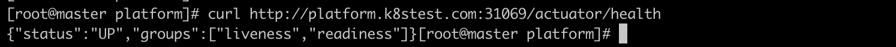

### 用户体验问题
另外需要考虑的一个问题，业务接口出现死锁，用户可能等待很久都没有响应，那么在 Ingress 上配置一个超时时间是非常有必要的。这里我设置了 `nginx.ingress.kubernetes.io/proxy-read-timeout: "5"`，表示如果请求在 5 秒内没有响应，就会返回 504 Gateway Timeout 错误。特别是电商类应用，接口响应时间过长，用户体验会非常差，所以设置一个合理的超时时间是非常重要的。

其实这里也要分很多种情况来配置超时，比如：

- 查询类，用户在打开页面检索商品，对于直接面向用户的核心API，理想的响应时间应控制在 500ms 以内，力争达到 200ms，极限不应超过 2-3秒
- 操作类，比如用户下单（双十一活动等），这涉及到数据库操作，用户在下单时，理想的响应时间应控制在 1 秒以内，极限不应超过 5 秒
- 外部依赖类，这些是属于保证事务的完整性，超时可以延长一些没问题

我在这里假定这是一个操作类接口，所以设置了 5 秒的超时时间。实际上，超时时间的设置需要根据业务场景和用户体验来综合考虑。
另外就是刚才提到的外部依赖类，需要在 service mesh 中配置超时时间，确保在调用外部服务时能够及时返回错误，而不是一直等待。 

我们可以把超时的指标采集纳入到监控系统中，及时发现和处理超时问题。但如果某个接口或服务经常超时，我认为如何解决超时问题才是至关重要的，需要考虑多个方面：

- 代码问题：是否存在性能瓶颈，是否有优化空间？
- 架构问题：是否存在单点故障，是否有冗余设计？
- 资源问题：是否存在资源不足，是否有扩容空间？
- 网络问题：是否存在网络延迟，是否有优化空间？
- 依赖问题：是否存在外部依赖，是否有可靠性保障？

根据我的个人经验，遇到最多的往往是代码问题 or 下游服务不可用导致的超时，比如依赖 redis 服务，可能会因为网络延迟、连接池耗尽等原因导致超时。这就需要我们在代码层面进行优化，比如使用异步调用、Pipeline 批处理等等。这里只是举个例子。

## 监控采集情况

因为我是本地cluster，先开启端口转发：

```
kubectl -n monitoring port-forward svc/kube-prometheus-stack-prometheus 19090:9090 >/dev/null 2>&1 &
```

项目的/metrics和/actuator/prometheus接口都可以正常访问

```
curl -s 'http://127.0.0.1:19090/api/v1/targets?state=active' | jq '.data.activeTargets[] | select(.labels.namespace=="spring-hello-problem") | {job:.labels.job, instance:.labels.instance, metrics_path:.discoveredLabels.__metrics_path__, health:.health, lastError:.lastError}'
```

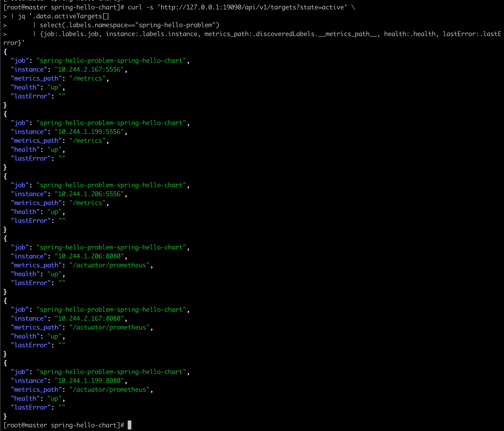

BLOCKED 指标采集情况

```
curl -G 'http://127.0.0.1:19090/api/v1/query' --data-urlencode 'query=sum by (pod) (jvm_threads_states_threads{namespace="spring-hello-problem",state="blocked"})' | jq
```

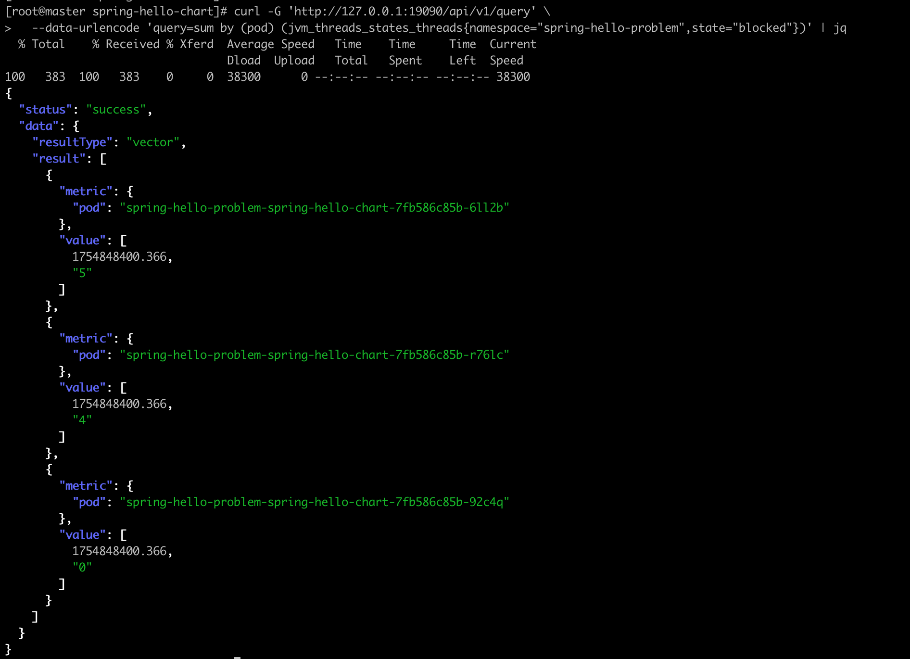

GC 指标采集情况（这里只看一个 GC Pause 的指标）

```
curl -G 'http://127.0.0.1:19090/api/v1/query' --data-urlencode 'query=sum by (pod) (rate(jvm_gc_pause_seconds_sum{namespace="spring-hello-problem"}[5m]))' | jq
```

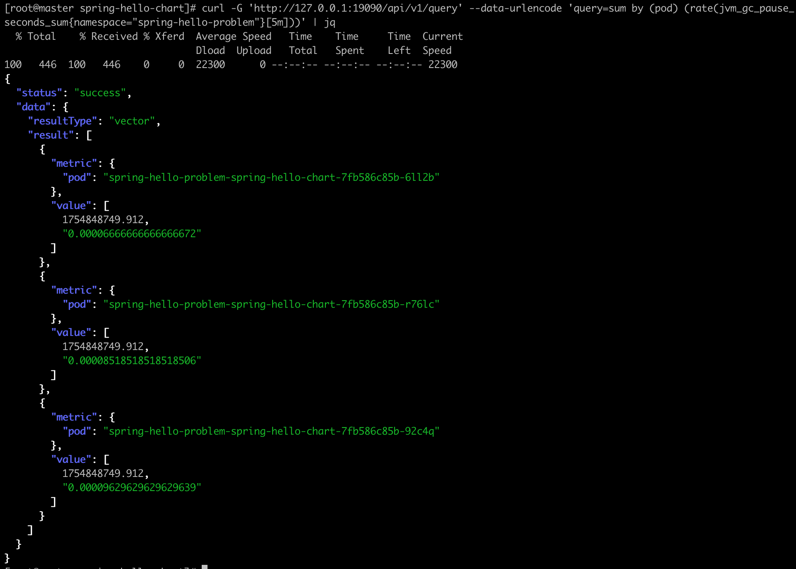

## Review

这是题目清单的要求：
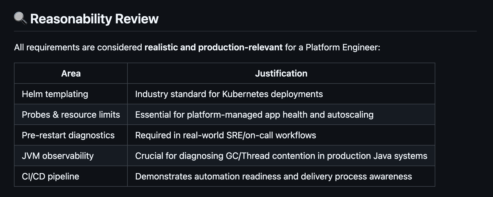

- Helm templating: DONE
- Probes & resource limits: DONE
- Pre-restart diagnostics: DONE
- JVM observability: DONE

每一项都总结一下：

- Helm templating: DONE

项目中包含了题目要求的所有 yaml，以及将动态变化的配置参数放在了 `values.yaml` 文件中，使用 Helm 模板引擎来渲染配置文件。包含了基本的 yaml 和额外引入的 yaml（比如 hpa.yaml）

这是 values.yaml 中要求存在的参数：
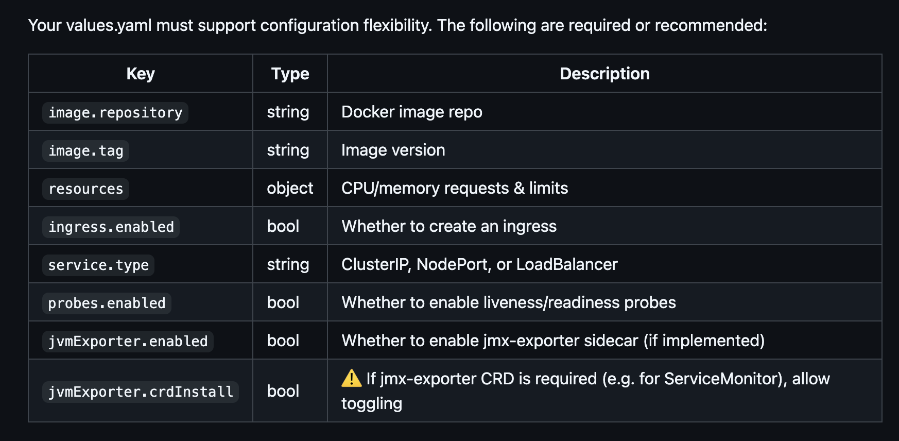

目前都已覆盖：

- [x] image.repository
- [x] image.tag
- [x] resources
- [x] ingress.enabled
- [x] service.type
- [x] probes.enabled
- [x] jvmExporter.enabled
- [x] jvmExporter.crdInstall

- Probes & resource limits: DONE

这里使用了 `/actuator/health` 作为探针接口，配置了 liveness、readiness 和 startup probes。资源限制设置为 CPU 100m，内存 128Mi 的请求，CPU 500m，内存 512Mi 的限制。

- Pre-restart diagnostics: DONE

`BLOCKED` 后的操作，不直接使用 preStop 来实现，因为这属于业务监控指标，使用 Prometheus + Grafana 来监控 BLOCKED 状态，并通过 Alertmanager 推送告警到 SRE Agent，完成自动化处理。或者短期方案是 Webhook + Scripts 来实现。另外建议通过 STDOUT 的方式来收集日志，统一上报到日志平台，这样符合云原生的理念。

- JVM observability: DONE

项目中提供了两种方式来采集 JVM 指标数据（包括 GC / Thread 等）：
1. 使用 Micrometer + Prometheus，直接通过 `/actuator/prometheus` 接口
2. 使用 JSON Exporter，这里我实际上还差一步，我只做到通过 `/actuator/metrics` 接口采集数据，我没有将 `/actuator/metrics` 接口的 JSON 输出转成 Prometheus 格式，但可以通过 JSON Exporter 来实现。

## 总结

这次测试绝大部分时间都是花在处理网络环境上，基本上走一步卡一步（欲哭无泪，Docker Hub 貌似是把大陆 IP 列入黑名单了），所以我是通过一些特殊的方式来解决镜像问题。

在生产环境下，安全性、稳定性和可维护性是非常重要的。如果在生产环境，需要把权限再收敛一些，比如增加 NetworkPolicy 来限制 Pod 的网络访问，确保 Pod 只能访问必要的服务和资源。这一块题目未要求，由于时间关系我就没有做，但生产环境的话，需要考虑进去。

# CI

这部分是最后一个环节，我觉得也非常重要，CI的高质量是保证整个项目顺利进行的关键，相当于是第一道坚固的防线。

我日常开发的流程遵循的是 gitflow 标准流程，比较习惯使用这样的分支:

- 主分支：master
- 开发分支：feature/*
- 修复分支：bugfix/*
- 预发布分支：release/*

所以我后续的操作都是以上面的规范来做演示，并且每个分支都有对应的 CI 配置文件，因为每个分支在 CI/CD 流程中都扮演着不同的角色。这里我主要关注的是主分支和开发分支的 CI 配置。

- master：包括了生产所需要的准备，比如镜像构建、验证 helm 有效性等等
- feature/*：包括了开发所需要的准备，比如代码扫描等等

图示：这是 master 分支的 CI 流水线触发情况，包含了题目要求的 image push 到 dockerhub，并进行 helm 验证等。
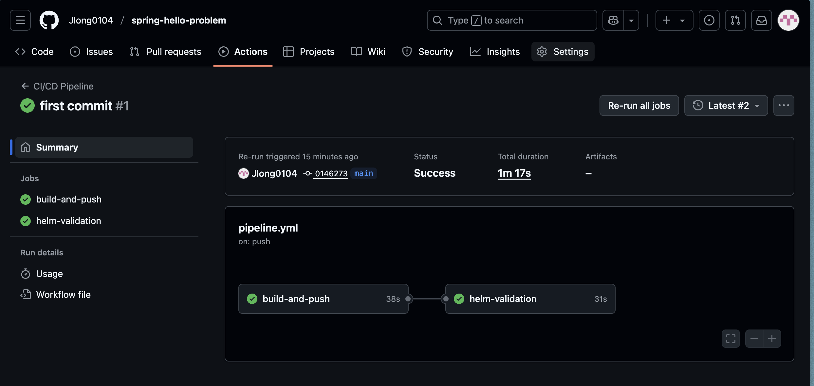

本地在测试的过程中，使用 yamllint 工具检测 yaml 格式是否正确：

```
yamllint .github/workflows/dev-pipeline.yml
yamllint .github/workflows/pipeline.yml
```

图示：yamllint结果


我在 CI 文件中配置了分支限制，因为需要确保每个分支都只执行对应的 pipeline。

```
name: Dev CI Pipeline

"on":
  pull_request:
  push:
    branches:
      - 'feature/**'
    paths-ignore:
      - "**/*.md"
```

```
name: Master CI Pipeline

"on":
  pull_request:
  push:
    branches:
      - 'master'
    paths-ignore:
      - "**/*.md"
```

实际上想要保持版本统一，最好的做法是通过打 tag 来触发 CI 流程，这样可以把 tag 当做事实来源，并使得 image 版本和 git 版本保持一致。我这里没有进行相关的配置演示了。

## 验证非 gitflow 相关分支的 CI 流程

**验证通过，在 main 分支推送代码后，不触发任何的 CI**

图示：通过 main 分支 push，对应的 commit 为 9e2a48
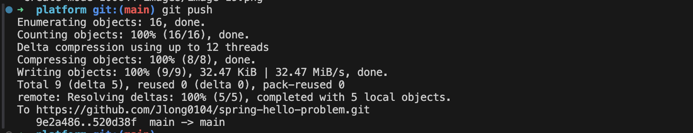

图示：没有对应的 commit 触发 CI
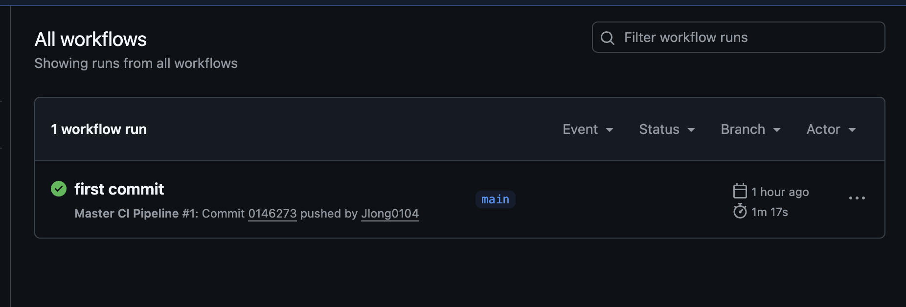

## 验证 feature 分支的 CI 流程

图示：通过 feature/ci-test 分支 push，对应的 commit 为 4eb7e05
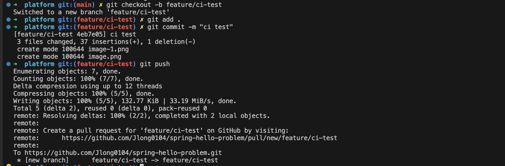

图示：feature/ci-test 分支触发了 CI
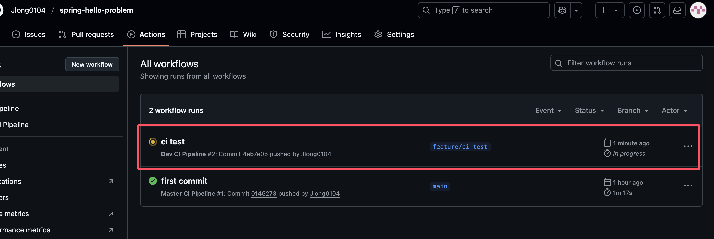

由于 feature 分支的 CI 流程中包含了代码扫描、单元测试、镜像扫描、安全扫描等，所以实际上目前的项目扫描出来基本上都是失败，由于时间关系，我没有去做修正（包括 Pod 的安全级别配置等等）。我只尝试升级 Spring Boot 的版本，结果是可以通过的。 

图示：安全扫描报出漏洞，不通过
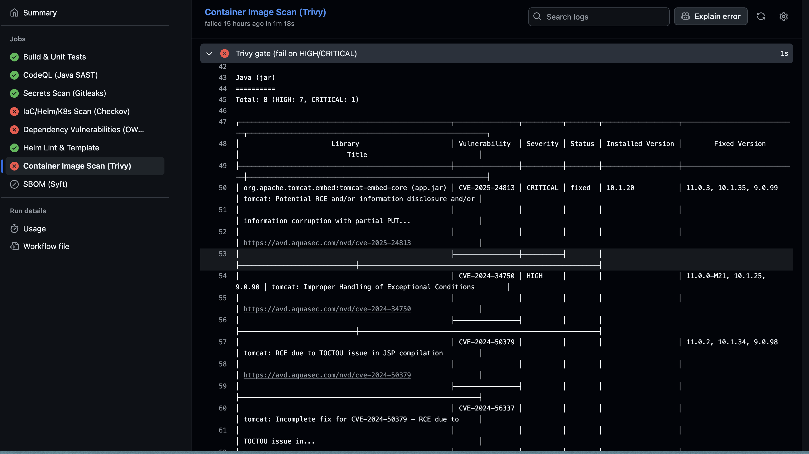

图示：升级 Spring Boot 版本后，扫描通过
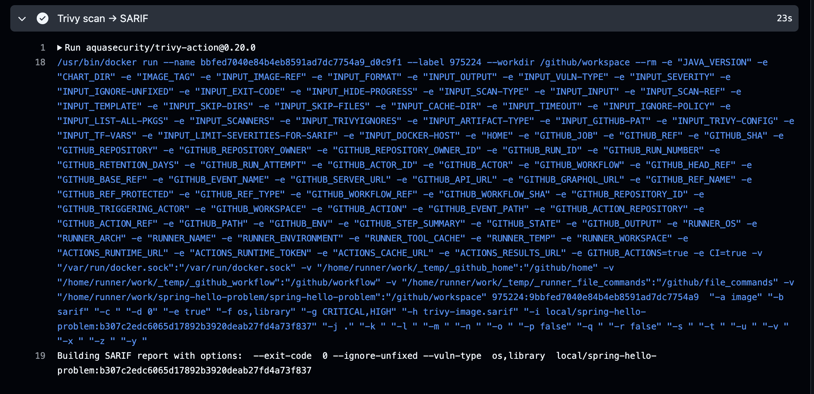

## 不同语言之前的 CI 差异

我日常最多的场景是对 Go 项目的 CI/CD，往往包括这些环节：代码检查、单元测试、构建镜像、安全扫描、性能测试。实际上这些环节都适用于所有的语言项目中。上生产前我一般都会强制做集成测试，因为很多功能点相对比较复杂，涉及并发验证，没办法用简单的单元测试覆盖，所以需要在上生产前，强制集成测试，能兜住至少 90% 的真实场景。

我觉得不管有多少项目和技术栈，可以按照三步来实现更好的 CI：
1、先制定 CI 规范，并将其模板化
2、将模板应用到各个项目中
3、持续优化 CI 流程

这样只需要修改模板，比如未来接入 AI 等新技术时，可以快速适配。

## 将 CI 模板化并测试

题目中要求的是把 CI 文件命名为 `pipeline.yml`，那这个流程的测试已经通过了，包括helm验证等。我将其抽象成模板 `standard-master-ci.yml`，并在`master-ci.yml`中引用。

这是测试结果，两者的行为一致

图示：`pipeline.yml` 和 `master-ci.yml` 同时触发并通过
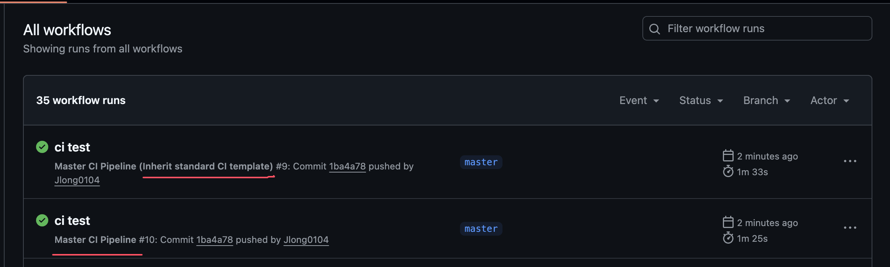

图示：`pipeline.yml`的 helm dry-run结果
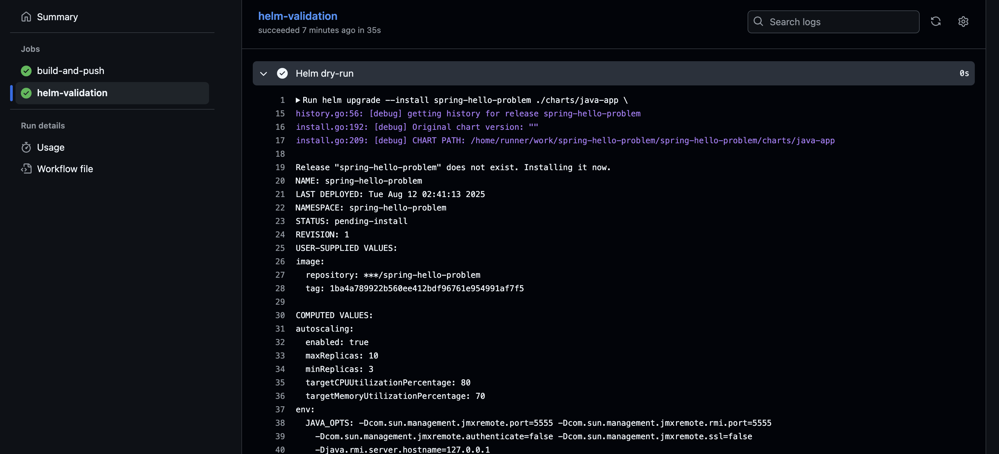

图示：`master-ci.yml`的 helm dry-run结果
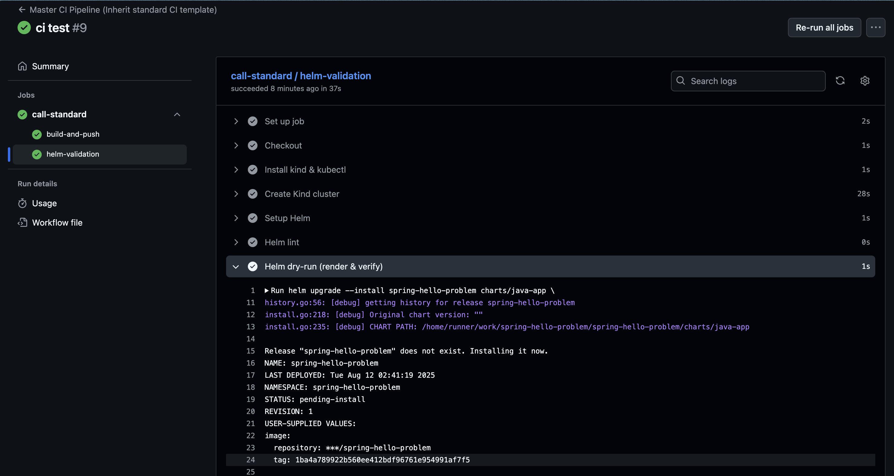

# 总结与思考

生产环境的 CI/CD 实际上比这要复杂得多很多，包括跨平台，需要面对不同的操作系统，需要面对不同的技术栈等等。题目目前只要求做到 CI 环节就结束了，在我看来，更复杂以及更有挑战性的，是在 CD 环节，因为一旦发布，那就是开始了真正的考验。因为 CI 失败了无伤大雅，可以多次调试，并且流程相对固定。CI 的难点更多的在于 效率、成本 这两者，因为 github 的 CI 是付费的，所以从公司的成本考虑如何保证 CI 质量的同时，最大程度降低成本。效率则是要求 CI 要快，越快越好，那么就可以从缓存、私有化等方向去尝试。

CD 需要考虑的因素有很多，比如发布策略、回滚机制、环境一致性等。发布策略可以选择金丝雀发布、蓝绿发布、滚动更新等方式。当然在云原生的生态中，这些已经得到了很好的解决，而我更多是在应对物理环境的变更发布，解决方案上肯定会有很大差异，但整体都是围绕这四个点来做：稳定性、效率、成本、安全。对于 CD 最基本的能力包括 流程编排、发布策略、并发控制、回滚策略等。

GitOps 实际上也能朝着 AIOps 发展，通过自动化和智能化的方式来提升运维效率和系统稳定性，但在整个系统中仍然依赖 GitOps，这是云原生环境的的 CD 最好的底座之一，能够为 AIOps 提供强有力的支撑。